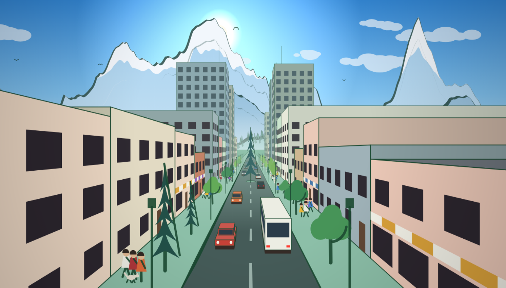
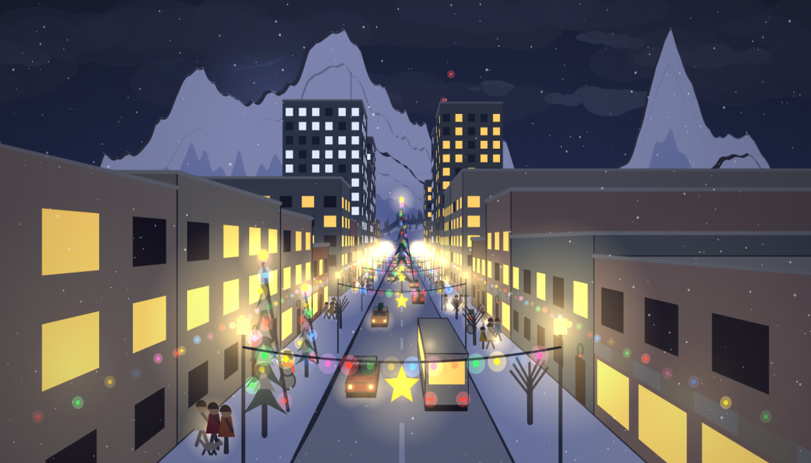
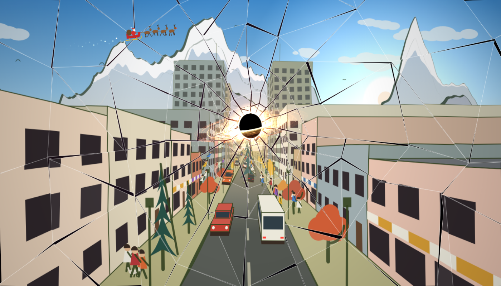
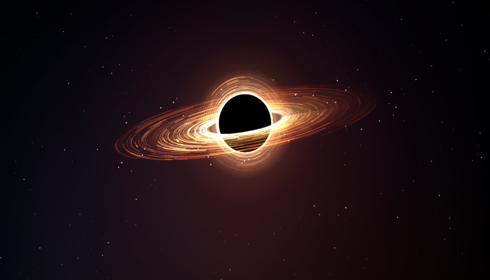

# Calligraphy City

**A street that runs to the mountains, inked in one HTML file. Until you break it.**

> **You are on the `city` branch.** This is an experiment built on top of
> [Calligraphy Mountains](https://github.com/anonym-sense/cal_ui_proc/tree/main),
> which lives on `main` and is what the
> [hosted page](https://anonym-sense.github.io/cal_ui_proc/) shows. The city is
> not hosted yet: check out this branch and open `index.html` in a browser.
>
> ```
> git clone -b city https://github.com/anonym-sense/cal_ui_proc.git
> ```



## What awaits on this branch

The hill town is gone. In its place is a city street drawn in one-point
perspective: the road is the `/\` of the picture, running from the bottom of
the screen to a vanishing point under a snow range, with buildings down both
sides that are large in front and shrink with distance.

It keeps everything the mountains did (the real clock, seasons, rain, snow,
Christmas lights, fireworks, the same little people) and adds one new button.

| Christmas night | Distort |
| --- | --- |
|  |  |

### The street

- **Buildings** on both sides, each with a long wall receding along the street
  and an end wall facing you; shop fronts under striped awnings at ground
  level, and a few taller towers further on.
- **The two kerbs** are the heavy broad-nib strokes, thinning toward the
  vanishing point.
- **People** on the pavements: townsfolk walk from door to door and pause at
  each, travellers walk the length of the street. Dogs, lanterns after dark,
  umbrellas in rain, and a dash for those caught without one.
- **Traffic** in two lanes: one comes toward you with headlights, one drives
  away with tail lights, and there is a bus.
- **The snow range** stands at the end of the street, drawn with the same
  calligraphy ridgelines as the original, with a snowline that moves with the
  season.
- **Time of day, seasons, rain and snow** work as on `main`: lit windows and
  street lamps at dusk, bare branches in winter, snow settling on roofs,
  awnings, car roofs and the road.
- **Christmas**: garlands with a gold star strung across the street between
  lamp posts, bulbs above the shop fronts, wreaths over doors, a great lit
  tree on an island in the road, cars carrying trees home, snowmen when the
  snow lies deep, and Santa on snowy nights.

### Distort

Press **Distort** (or `D`):

1. The page flashes and shakes, and cracks spread from the middle of the pane.
2. The pane splits into shards that ease apart, the street still alive on them.
3. A black hole opens near the vanishing point and slowly grows.
4. People, cars and Santa are pulled in first, then lamps and trees, then the
   buildings, then the shards themselves, each on a tightening spiral.
5. After about sixteen seconds only the black hole is left.



The black hole is generated in code: a rotating accretion disk that is hotter
and faster toward the middle and brighter on its approaching side, the far
side of the disk bent into a halo round the shadow, a photon ring, and a
starfield pushed outward round it. The button then reads **Restore**, which
closes the hole and brings the street back.

## Controls

| Control | Key | What it does |
| --- | --- | --- |
| Slider | | Preview any time of day |
| Live | `L` | Follow the real clock again |
| Day cycle | `C` | Play a whole day in one minute |
| Season | `S` | Cycle auto / spring / summer / autumn / winter (auto follows the calendar) |
| Rain | `W` | Rain; umbrellas go up along the pavements |
| Snow | `N` | Snowfall; the street whitens as it settles and melts when turned off |
| Christmas lights | `X` | Garlands, bulbs, wreaths and the great tree (on by default in December) |
| Night fireworks | `F` | Fireworks from the far end of the street once it is dark |
| New city | `R` | Generate a new street |
| Distort / Restore | `D` | Break the glass and let the black hole take the scene, or bring it back |

URL parameters pin a scene, for example
`index.html?seed=77&t=21.5&season=winter&snow=1&xmas=1`:

| Parameter | Values |
| --- | --- |
| `seed` | integer; the same seed gives the same street |
| `t` | hour of day, `0`–`24` |
| `season` | `spring`, `summer`, `autumn`, `winter` |
| `rain` | `1` or `0` |
| `snow` | `1` or `0` |
| `xmas` | `1` or `0` |
| `ui` | `0` hides the control panel |
| `dz` | seconds; opens part-way through the distortion (`dz=20` is the black hole alone) |

## Status

- Checked only as still screenshots in headless Microsoft Edge, at 1400×800
  and 500×900, by day and night, in rain and snow, and at several points in
  the distortion. The animation has not been reviewed running, and frame rate
  has not been measured.
- Buildings torn loose during Distort fly in as fairly plain blocks: their end
  walls have no windows where a nearer building used to hide them.
- The cyclists and the mountain climbers from `main` are not in the city.
- Sunrise and sunset are fixed at 06:00 and 18:00, and seasons follow
  northern-hemisphere months, as on `main`.
- There are no automated tests.

## License

MIT, see [LICENSE](LICENSE). The project uses no third-party code or assets;
see [NOTICE.md](NOTICE.md).
