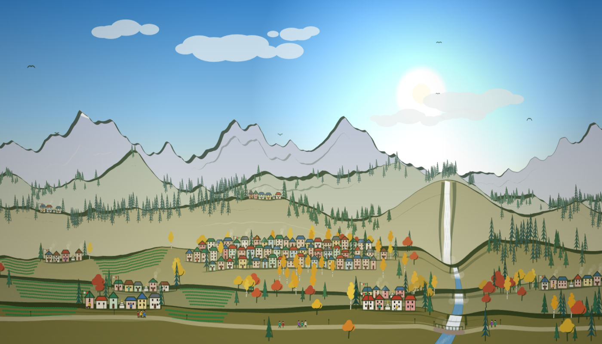
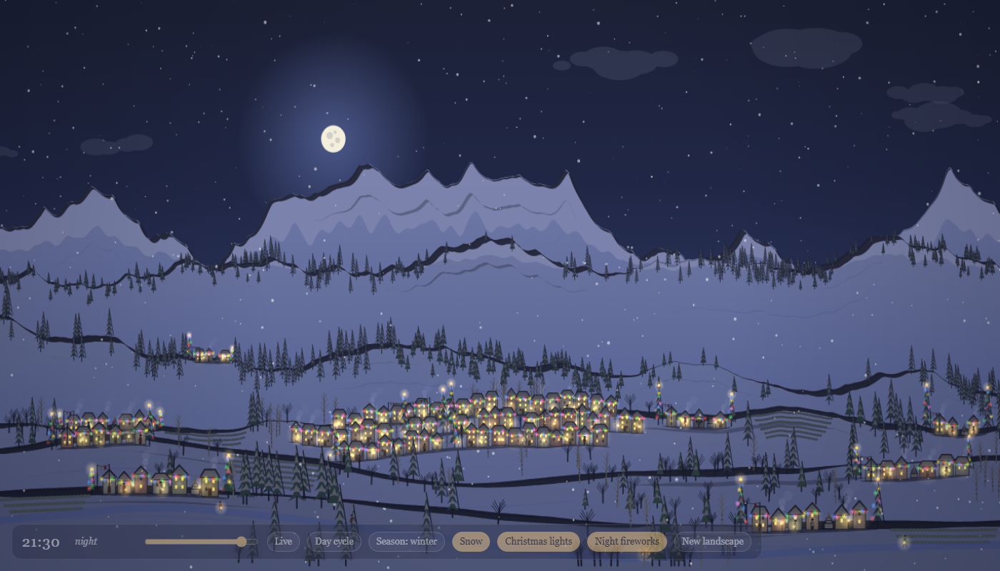

# Calligraphy Mountains

A procedurally generated hill-station landscape drawn on an HTML canvas, in
one self-contained file. No libraries, no build step, no assets: open
`index.html` in a browser.

## What it draws

- **Mountains** from layered 1D gradient noise: ridged multifractal noise for
  the craggy far peaks, smooth fBm for the rolling near hills.
- **Calligraphy ridgelines**: each ridge is a broad-nib pen stroke (a pen edge
  held at a fixed angle and swept along the path), so the line swells on
  up-slopes and thins on down-slopes, with dry-brush gaps. Two fainter echoes
  of the ridge repeat lower on each slope.
- **A ridge town and hamlets** in the style of a Himalayan hill station
  (Darjeeling was the reference): cottages with coloured walls and painted tin
  roofs, placed only where the ground is gentle, with street lamps, prayer
  flags, small shrines and tea gardens following the contour.
- **Forest**: pines and cedars on the high and steep ground, aspen groves on
  the easy slopes, broadleaf trees lower down, bare ground above the treeline.
- **People**: townsfolk walk from door to door along their own lane and pause
  at each; travellers keep to the road across the foreground.
- **Time of day** from the real clock: sky, mountain, ink and haze colours,
  sun and moon, stars, lit windows and lanterns all follow the hour.
- **Seasons**: spring blossom, summer green, autumn colour, bare winter
  branches, and a snowline that moves with the season.
- **Water**: a stream gathers in a high valley, reaches a notch between two
  shoulders and drops as a waterfall, feeding a river that cascades over
  every nearer ridge and runs under a footbridge on the road. The flow follows the
  season (spring snowmelt, a summer trickle, frozen in winter) and runs at its
  fullest in rain.
- **Rain days**: decided once per calendar day, likeliest in summer; rain
  brings heavy cloud, umbrellas for most walkers and a dash for those without;
  it also
  greys the sky and swells the river.
- **Dogs** trot behind some of the walkers, cyclists ride the road, and lamp
  posts line the lanes,
  the road and the bridge.
- **On the mountains**: roped teams climb to the summits and plant a flag.
- **In the sky**: shooting stars on clear summer nights when the fireworks are
  off, and Santa on snowy nights when the Christmas lights are on.
- **Snow, Christmas lights and night fireworks**, each optional.

## Controls

| Control | Key | What it does |
| --- | --- | --- |
| Slider | | Preview any time of day |
| Live | `L` | Follow the real clock again |
| Day cycle | `C` | Play a whole day in one minute |
| Season | `S` | Cycle auto / spring / summer / autumn / winter (auto follows the calendar) |
| Rain | `W` | Rain; the waterfall and river rise to full flood, then drop back slowly |
| Snow | `N` | Snowfall; the landscape whitens as it settles and melts when turned off |
| Christmas lights | `X` | Coloured bulbs on eaves and conifers (on by default in December) |
| Night fireworks | `F` | Fireworks over the town once it is dark |
| New landscape | `R` | Generate a new scene |

URL parameters pin a scene, for example
`index.html?seed=77&t=21.5&season=winter&xmas=1`:

| Parameter | Values |
| --- | --- |
| `seed` | integer; the same seed gives the same landscape |
| `t` | hour of day, `0`–`24` |
| `season` | `spring`, `summer`, `autumn`, `winter` |
| `rain` | `1` or `0` |
| `snow` | `1` or `0` |
| `ui` | `0` hides the control panel |
| `xmas` | `1` or `0` |

## Status

- Rendered and checked in headless Microsoft Edge at 1400×800 in summer,
  autumn and winter, by day and by night, with and without rain, and at phone
  sizes (500×900 portrait, 844×400 landscape). On narrow or touch screens the
  controls collapse to a one-line bar with a Controls button. Other browsers and real phones
  have not been tested.
- Sunrise and sunset are fixed at 06:00 and 18:00; they are not computed from
  a location or date.
- Seasons follow northern-hemisphere months.
- There are no automated tests.

## License

MIT, see [LICENSE](LICENSE). The project uses no third-party code or assets;
see [NOTICE.md](NOTICE.md).
